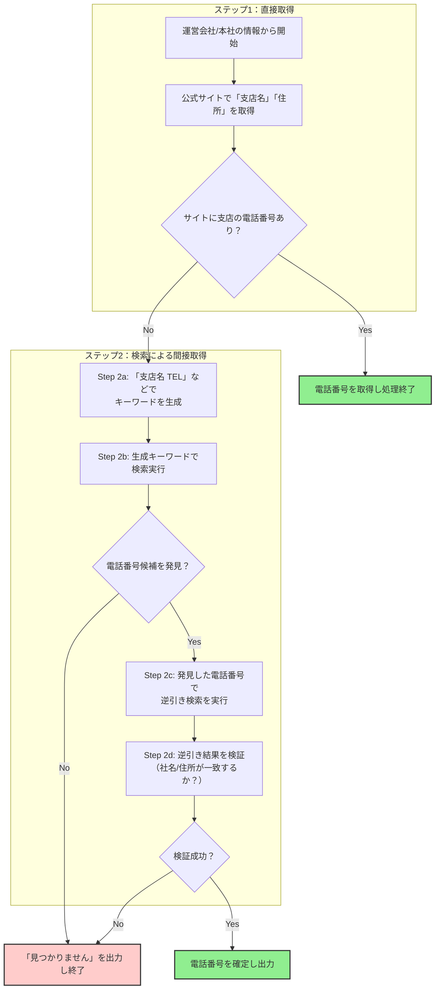

```mermaid

graph TD
    A[運営会社/本社の情報から開始];
    A --> B[公式サイトで「支店名」「住所」を取得];
    B --> C{サイトに支店の電話番号あり？};
    C -- Yes --> D[電話番号を取得し処理終了];
    C -- No --> E[Step 2a: 「支店名 TEL」などで<br>キーワードを生成];
    E --> F[Step 2b: 生成キーワードで検索実行];
    F --> G{電話番号候補を発見？};
    G -- No --> H[「見つかりません」を出力し終了];
    G -- Yes --> I[Step 2c: 発見した電話番号で<br>逆引き検索を実行];
    I --> J[Step 2d: 逆引き結果を検証<br>（社名/住所が一致するか？）];
    J --> K{検証成功？};
    K -- Yes --> L[電話番号を確定し出力];
    K -- No --> H;

    subgraph "ステップ1：直接取得"
        A
        B
        C
    end

    subgraph "ステップ2：検索による間接取得"
        E
        F
        G
        I
        J
        K
    end

    style D fill:#90ee90,stroke:#333,stroke-width:2px
    style L fill:#90ee90,stroke:#333,stroke-width:2px
    style H fill:#ffcccb,stroke:#333,stroke-width:2px
```
